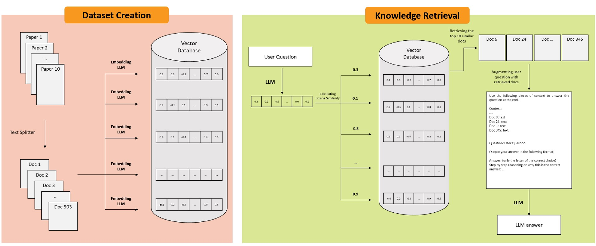

# CONFLARE: CONFormal LArge language model REtrieval

This is the repo for the [CONFLARE paper](arxiv.com) giving an easy access to scripts to do RAG w/ Conformal guarantees.
These are 3 main tasks that this repo helps you with:

1. Loading the source documents (+ cleaning and chunking them)
2. Creating (or loading) a Calibration set
3. Retrieval Augmented Generation by applying conformal prediction

Put your `.pdf` documents in the directory specified in `configs/paths.py` and run the following. (default: `DOCUMENT_DIR = "./data/documents"`)

Look at the `main.py` file for how to use the repo in details.
Example:

```python
# 1
docs, qa_pipeline, vector_db = initialize_pipeline(configs)

# 2
calibration_records = create_calibration_records(
    docs,
    qa_pipeline=qa_pipeline,
    vector_db=vector_db,
    size=100,
    topic_of_interest="Deep Learning"
)

# 3
conformal_rag = ConformalRetrievalQA(
    qa_pipeline=qa_pipeline,
    vector_db=vector_db,
    calibration_records=calibration_records,
    error_rate=0.10,
    verbose=True
)

response, retrieved_docs = conformal_rag(
    "How can a transformer model be used in detection of COVID?"
)
print(response)
```
```
>>>
Input Error Rate: 10.00%
Selected cosine distance thereshold: 0.456
Number of retrieved documents: 2

A transformer model can be used in the detection of COVID-19 by analyzing medical images ...
```

If you have run this script once before and saved the calibration records to disk, you can use the following to load the calibration records:

```python
q_evaluation = QuestionEvaluation.from_pickle(path_to_pickle)
calibration_records = q_evaluation.get_calibration_records()
```



