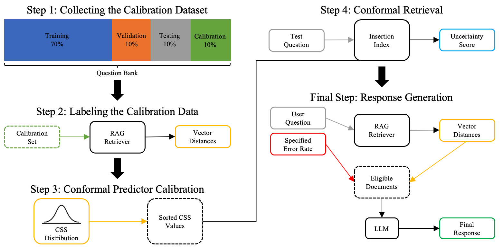

# CONFLARE: CONFormal LArge language model REtrieval

 

This is the repo for the [CONFLARE article](arxiv.com), which provides easy access to scripts for performing RAG with Conformal guarantees.

Here are the 3 main tasks which this repo helps you with:

1. Loading the source documents (+ cleaning and chunking them)
2. Creating (or loading) a Calibration set
3. Retrieval Augmented Generation by applying conformal prediction

## How to use

Put your `.pdf` documents in the directory specified in `configs/paths.py` (default: `DOCUMENT_DIR = "./data/documents"`) and run the following codes, similar to the `main.py` file.

```python
# 1
docs, qa_pipeline, vector_db = initialize_pipeline(configs)

# 2
calibration_records = create_calibration_records(
    docs,
    qa_pipeline=qa_pipeline,
    vector_db=vector_db,
    size=100,
    topic_of_interest="Deep Learning"
)

# 3
conformal_rag = ConformalRetrievalQA(
    qa_pipeline=qa_pipeline,
    vector_db=vector_db,
    calibration_records=calibration_records,
    error_rate=0.10,
    verbose=True
)

response, retrieved_docs = conformal_rag(
    "How can a transformer model be used in detection of COVID?"
)
print(response)
```
Example output:
```
>>>
Input Error Rate: 10.00%
Selected cosine distance thereshold: 0.456
Number of retrieved documents: 2

A transformer model can be used in the detection of COVID-19 by analyzing medical images ...
```

If you have run this script once before and saved the calibration records to disk, you can use the following to load the calibration records:

```python
q_evaluation = QuestionEvaluation.from_pickle(path_to_pickle)
calibration_records = q_evaluation.get_calibration_records()
```
## Citation

If you use this code in your research, please cite the following paper:

```
@article{conflare,
  title={CONFLARE: CONFormal LArge language model REtrieval},
  author={Pouria Rouzrokh and Shahriar Faghani and Cooper U. Gamble and Moein Shariatnia and Bradley J. Erickson},
  journal={arXiv preprint arXiv:2404.04287},
  year={2024},
  eprint={2404.04287},
  archivePrefix={arXiv},
  primaryClass={cs.CL}
}
```
